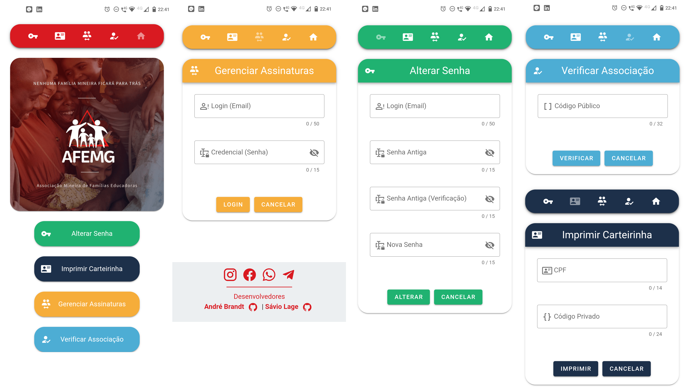

# AFEMG Id Generator (Frontend Only)

<p align="center">
  <a href="https://afemg-clients.web.app/">
    
  </a>
</p>

<div style='text-align: justify;'>ID generator for AFEMG (Associação Mineira de Famílias Educadoras). The administrator can regiester AFEMG's associates so they can use credentials to generate and print their ID. The ID contains two codes: public and private. The public one can be used on AFEMG's website to validate it's signature. The private one can be used with the user's CPF to generate a ID dynamically. Partner companies can use AFEMG's validation system to provide discounts and benefits to members and associates. Click <a href="https://afemg-clients.web.app/">here</a> or in the logo above to go to the website.
</div>

<br/>

<p align="center">

</p>

<br/>

#### Used Technologies
- <a href="https://vuejs.org/">Vue</a>
- <a href="https://vuetifyjs.com/en/">Vuetify</a>
- <a href="https://nodejs.org/en/">Node</a>
- <a href="https://www.mongodb.com/">MongoDB</a>
- <a href="https://developer.mozilla.org/pt-BR/docs/Web/JavaScript">Javascript</a>

<br/>

#### Collaborators
- <a href="https://github.com/Saviollage">Sávio Lage (Backend)</a>
<br/>

## Project setup
```
yarn install
```

### Compiles and hot-reloads for development
```
yarn serve
```

### Compiles and minifies for production
```
yarn build
```

### Lints and fixes files
```
yarn lint
```

### Customize configuration
See [Configuration Reference](https://cli.vuejs.org/config/).
